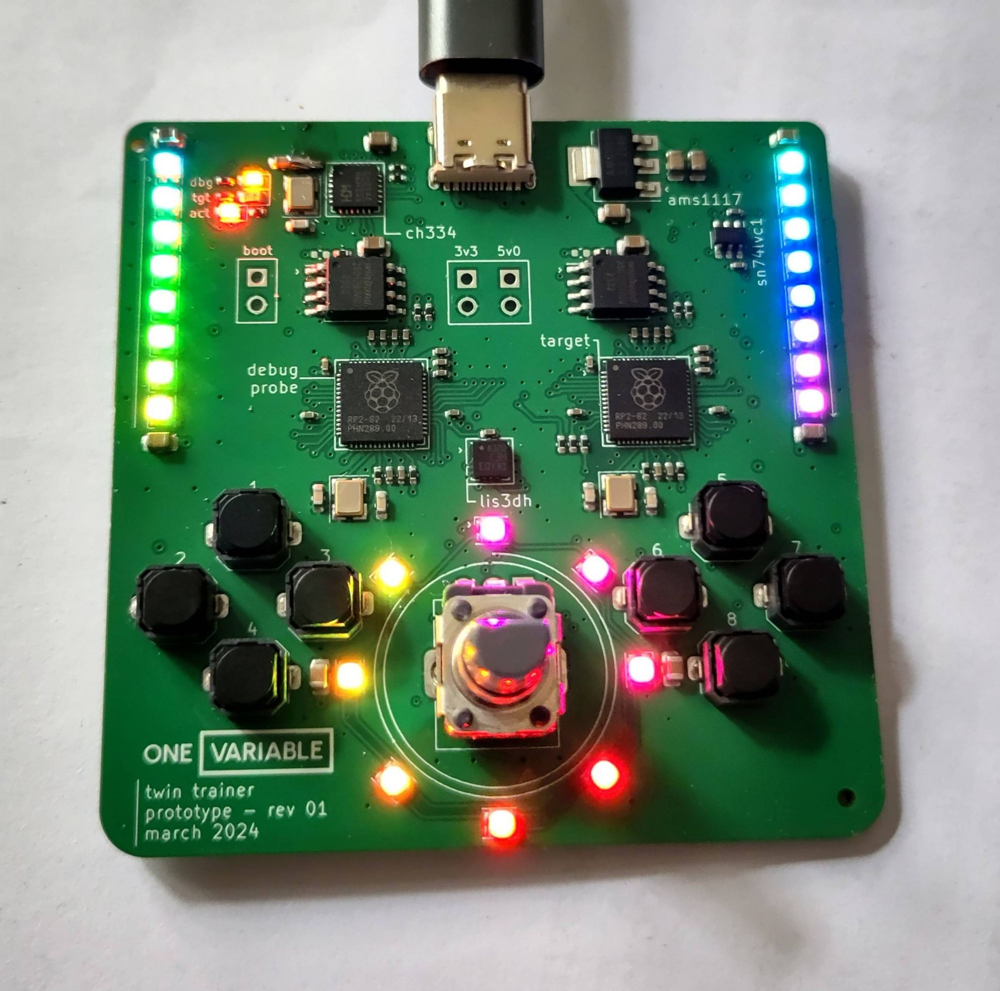
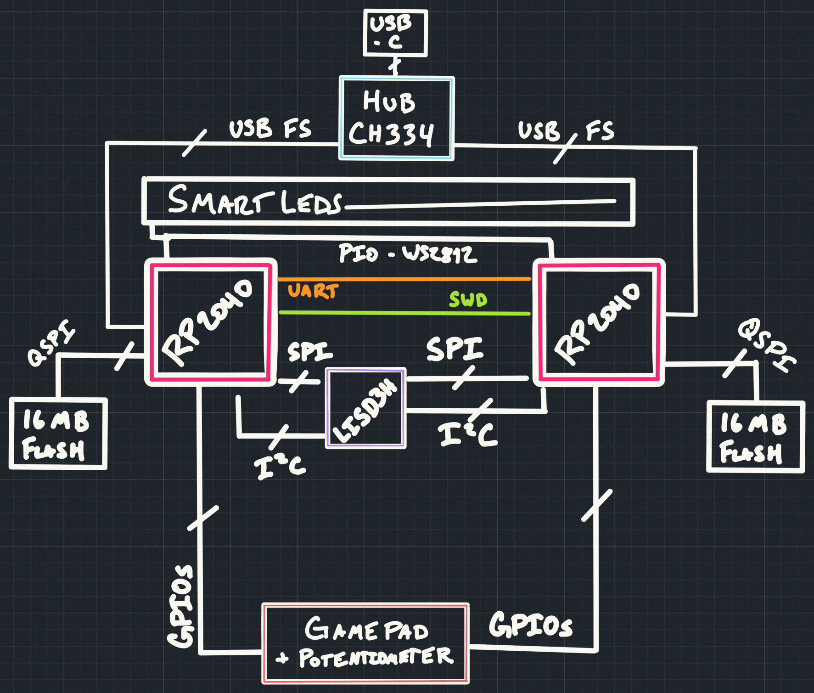

# Get to know the board

This is our board, the OneVariable Twin Trainer.

## Links

You can view the KiCAD design files [in the hardware repo][hw repo].

You can view the schematic as a PDF [here][schematic pdf].

[hw repo]: https://github.com/OneVariable/ov-twin
[schematic pdf]: https://github.com/OneVariable/ov-twin/blob/main/assets/ov-twin.pdf

## Block Diagram

## Main Parts

| Part Usage    | Part Number   | Notes                                                                 |
| :---          | :---          | :---                                                                  |
| Debugger      | RP2040        | Using [debugprobe] firmware                                           |
| Target        | RP2040        | Dual Core Cortex-M0+ at 133MHz  264KiB RAM 16MiB QSPI Flash   |
| USB Hub       | CH334F        | Allows both chips to talk through one USB port                        |
| Accelerometer | LIS3DH        | Usable over SPI or I2C, we will use SPI                               |
| SmartLEDs     | TX1812Z5      | Similar to WS2812B, SK6812, or "neopixels", 16M color                 |
| Buttons       | K2-1817UQ     | Square soft push buttons                                              |
| Potentiometer | RK09D1130C3W  | 10K Potentiometer, 0v0 to 3v0                                         |

[debugprobe]: https://github.com/raspberrypi/debugprobe

## GPIO List (target board)

| GPIO Name | Usage                     | Notes                             |
| :---      | :---                      | :---                              |
| GPIO00    | Button 1                  | Button Pad (left) - active LOW    |
| GPIO01    | Button 2                  | Button Pad (left) - active LOW    |
| GPIO02    | Button 3                  | Button Pad (left) - active LOW    |
| GPIO03    | Button 4                  | Button Pad (left) - active LOW    |
| GPIO04    | SPI MISO/CIPO             | LIS3DH                            |
| GPIO05    | SPI CSn                   | LIS3DH                            |
| GPIO06    | SPI CLK                   | LIS3DH                            |
| GPIO07    | SPI MOSI/COPI             | LIS3DH                            |
| GPIO08    | I2C SDA                   | LIS3DH (not used)                 |
| GPIO09    | I2C SCL                   | LIS3DH (not used)                 |
| GPIO10    | Interrupt 2               | LIS3DH (optional) - active LOW    |
| GPIO11    | Interrupt 1               | LIS3DH (optional) - active LOW    |
| GPIO12    | Not Used                  |                                   |
| GPIO13    | Not Used                  |                                   |
| GPIO14    | Not Used                  |                                   |
| GPIO15    | Not Used                  |                                   |
| GPIO16    | UART TX                   | Debugger UART                     |
| GPIO17    | UART RX                   | Debugger UART                     |
| GPIO18    | Button 5                  | Button Pad (right) - active LOW   |
| GPIO19    | Button 6                  | Button Pad (right) - active LOW   |
| GPIO20    | Button 7                  | Button Pad (right) - active LOW   |
| GPIO21    | Button 8                  | Button Pad (right) - active LOW   |
| GPIO22    | Not Used                  |                                   |
| GPIO23    | Not Used                  |                                   |
| GPIO24    | Not Used                  |                                   |
| GPIO25    | Smart LED                 | 3v3 output                        |
| GPIO26    | ADC0                      | Potentiometer                     |
| GPIO27    | Not Used                  |                                   |
| GPIO28    | Not Used                  |                                   |
| GPIO29    | Not Used                  |                                   |
